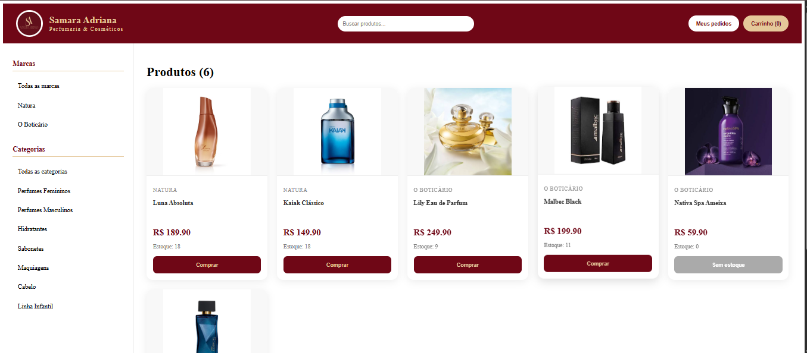
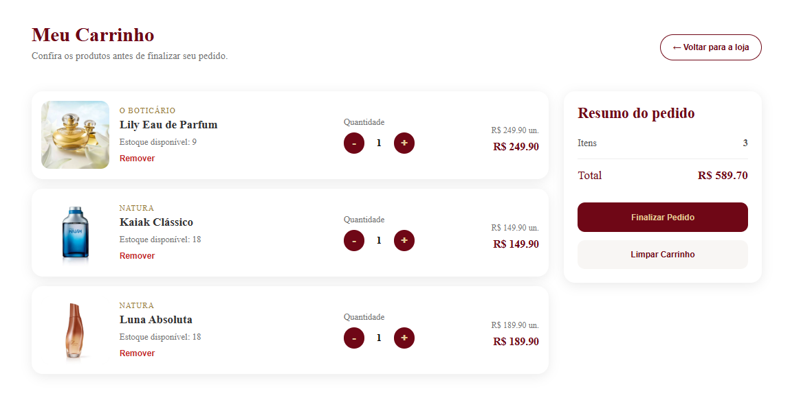
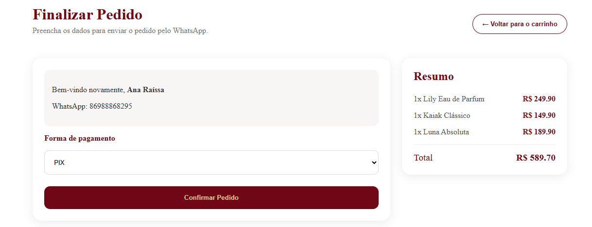
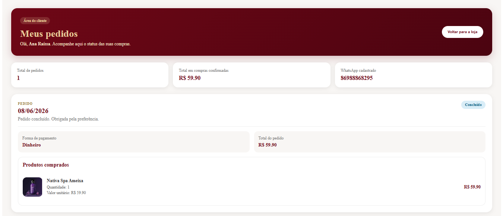
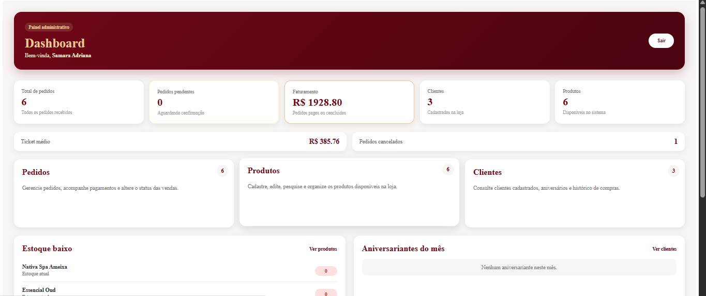
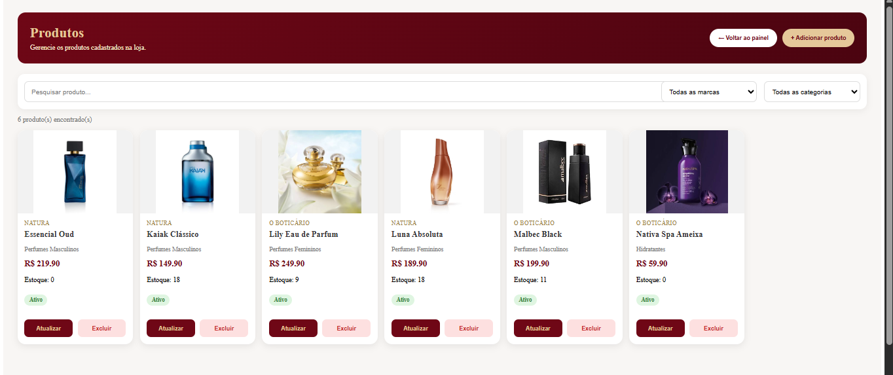
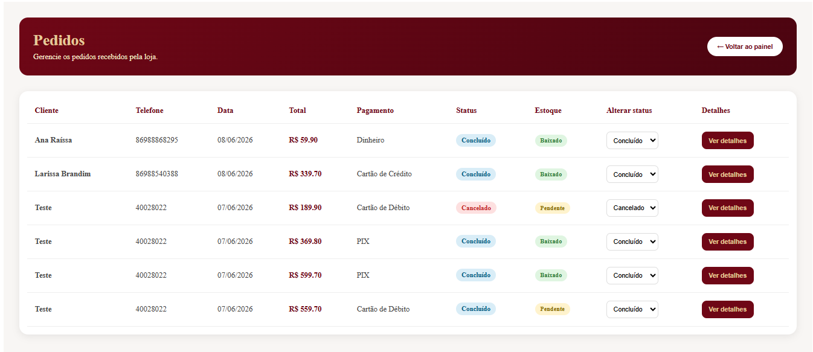
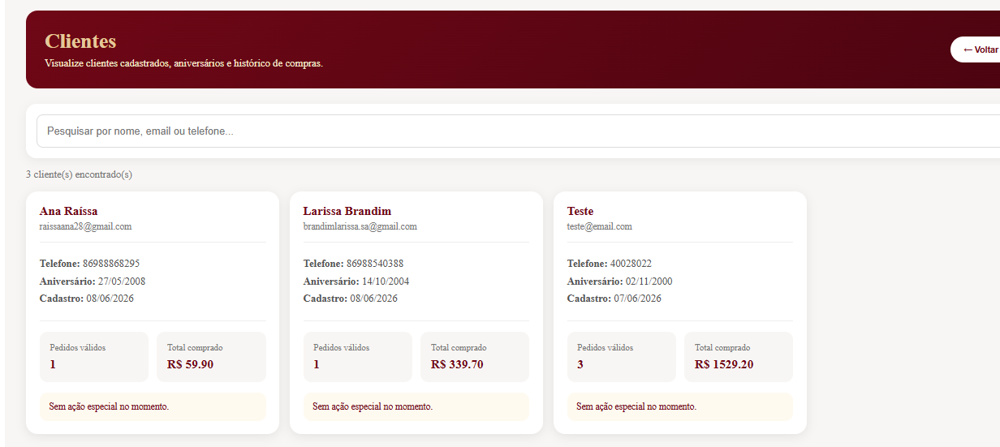

# Samara Adriana Perfumaria & Cosméticos

## Objetivo do Sistema

O sistema foi desenvolvido para a loja Samara Adriana Perfumaria & Cosméticos com o objetivo de digitalizar o processo de vendas, gerenciamento de produtos, controle de estoque, acompanhamento de pedidos e gestão de clientes.

A plataforma oferece uma área para os clientes realizarem compras online e uma área administrativa para gerenciamento completo da loja.

---

## Tecnologias Utilizadas

### Front-end
- Vue.js 3
- Vue Router
- Pinia
- JavaScript
- HTML5
- CSS3

### Banco de Dados
- Supabase

### Controle de Versão
- Git
- GitHub

### Hospedagem
- Vercel

---

## Funcionalidades Implementadas

### Área do Cliente

- Visualização de produtos cadastrados
- Busca de produtos
- Visualização detalhada dos produtos
- Carrinho de compras
- Controle de estoque em tempo real
- Finalização de pedidos
- Cadastro automático de clientes
- Histórico de pedidos
- Acompanhamento do status dos pedidos

### Área Administrativa

- Login administrativo
- Controle de autenticação com Pinia
- Dashboard administrativo
- Visualização de faturamento
- Controle de pedidos pendentes
- Controle de pedidos cancelados
- Gestão completa de produtos (CRUD)
- Gestão de clientes
- Controle de estoque
- Identificação de produtos com estoque baixo
- Visualização de aniversariantes do mês
- Alteração de status dos pedidos
- Atualização automática do estoque após conclusão do pedido

---

## Estrutura do Projeto

```text
src/
├── assets/
│
├── components/
│   ├── Header.vue
│   └── ProductCard.vue
│
├── views/
│   ├── HomeView.vue
│   ├── CartView.vue
│   ├── CheckoutView.vue
│   ├── LoginView.vue
│   ├── AdminView.vue
│   ├── AdminProdutosView.vue
│   ├── AdminPedidosView.vue
│   ├── AdminClientesView.vue
│   └── MeusPedidosView.vue
│
├── stores/
│   ├── cart.js
│   └── auth.js
│
├── router/
│   └── index.js
│
├── lib/
│   └── supabase.js
│
└── App.vue
```

---

## Prints/Telas do Sistema

### Página Inicial da Loja



### Carrinho de Compras



### Tela de Checkout



### Área de Meus Pedidos



### Dashboard Administrativo



### Gestão de Produtos



### Gestão de Pedidos



### Gestão de Clientes



---

## Como Executar o Projeto

### Sistema em Produção

Acesse o sistema através do link:

https://sa-perfumaria-e-cosmeticos-git-main-larissa-brandi-s-projects.vercel.app/

### Área Administrativa

Acesso administrativo:

```text
/gestao
```

Exemplo:

```text
https://sa-perfumaria-e-cosmeticos-git-main-larissa-brandi-s-projects.vercel.app/gestao
```

---

## Integrantes da Equipe

- Larissa Brandim
- Vithor Gabriel

---

## Cliente

**Samara Adriana Perfumaria & Cosméticos**

Sistema desenvolvido para gerenciamento de produtos, clientes e pedidos da loja.

---

## Vídeo Demonstrativo

Link do vídeo:

*(Inserir link do vídeo aqui)*

---

## Repositório GitHub

Link do repositório:

https://github.com/brandim04/SA-Perfumaria-e-Cosmeticos

---

## Considerações Finais

O projeto foi desenvolvido utilizando Vue.js, Pinia e Supabase, aplicando conceitos de componentização, gerenciamento de estado, autenticação, CRUD completo, integração com banco de dados e organização de projeto.

Além dos requisitos mínimos propostos, foram implementadas funcionalidades adicionais como histórico de pedidos do cliente, dashboard administrativo com métricas, controle automático de estoque e indicadores de gestão, tornando o sistema mais próximo de uma aplicação comercial real.
